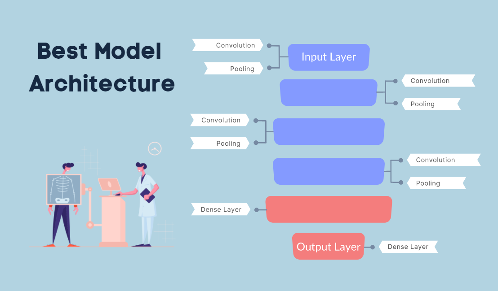

# **Pneumonia Classification**


**Authors:** _Anthony, Hoang, Madoria, Matthew_

## Overview


'ICD 10-M Diagnosis Code J15. 9'

" Pneumonia is a form of acute respiratory infection that affects the lungs. The lungs are made up of small sacs called alveoli, which fill with air when a healthy person breathes. When an individual has pneumonia, the alveoli are filled with pus and fluid, which makes breathing painful and limits oxygen intake. " - [WHO](https://www.who.int/news-room/fact-sheets/detail/pneumonia)

According to the World Health Organization and UNICEF, pneumonia kills more children than any other infectious disease, disproportionately affecting low-income countries. In 2019, pneumonia killed over 740,000 children under the age of 5 or roughly about 1,900 children a day. This accounts for 14% of all deaths of children under five years old with almost all these deaths being preventable. 

## Business Problem

UNICEF and the WHO have made a joint effort in tackling childhood pneumonia The increasing unmet demand for trained health experts to meet population medical needs has lead them to explore technology that could help reduce the burden on the already stressed medical system. They have hired our group for data science and deep learning recommendations for this problem. 

Metrics we care about: </br>
- Accuracy </br>
- False Negatives: This matters because we don't want to tell patients they are not sick when they actually are </br>
- False Positives: This matters because the treatment used for bacterial pneumonia is anti-biotics. Antibacterial resistance is becoming a global threat. More and more research is being published on it. Overprescribing antibiotics to patients that don't need them is a big part of this problem that we want to avoid. 

***
## Data

The dataset contains pediatric lung X-Rays from Guangzhou Women and Children’s Medical Center in Guangzhou, China. This dataset consists of 3 different folders of train, test, and val sets with each folder containing another 2 seperate folders of pneumonia vs normal lung x-ray images. We are using the [Kaggle](https://www.kaggle.com/paultimothymooney/chest-xray-pneumonia) version of this dataset that has 5856 images. 


***
## Methods

Our methods involve training several neural networks, including:

- Convolutional Neural Networks (CNN)
- Multilayer Perceptron
- Residual Network 152 (ResNet152)
- DenseNet121

***
## Results




***
## Conclusion

***
## Next Steps
Further analyses could result with additional insights to further improve our recommendations:


***
## For More Information
Please review our full analysis in our [Jupyter Notebook]() or our [presentation]().

For any additional questions, please contact:

Anthony: https://www.linkedin.com/in/anthonywarren11037/</br>
Hoang: https://www.linkedin.com/in/hoang-nguyen-0ba498207/</br>
Madoria: https://www.linkedin.com/in/madoria-thomas/</br>
Matthew: https://www.linkedin.com/in/matthew-samson-0a1b86165/</br>

## Repository Structure

```
├── README.md                           
├── Main.ipynb   
├── Presentation.pdf   
├── data                                
└── images 
```
