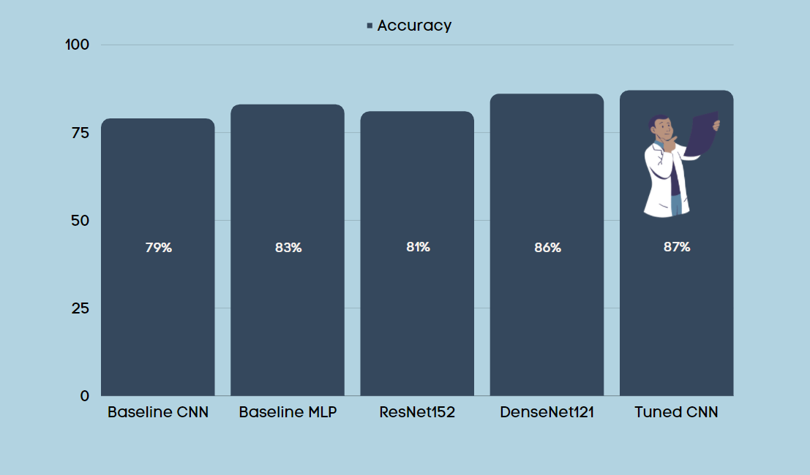
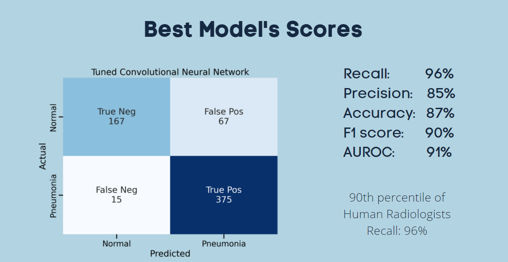

# **Pneumonia Classification**


**Authors:** _Anthony Warren, Hoang Nguyen, Madoria Thomas, Matthew Samson_

(Note: This is a hypothetical presentation, as if commissioned by UNICEF and the WHO.)

## Overview


'ICD 10-M Diagnosis Code J15. 9'

"Pneumonia is a form of acute respiratory infection that affects the lungs. The lungs are made up of small sacs called alveoli, which fill with air when a healthy person breathes. When an individual has pneumonia, the alveoli are filled with pus and fluid, which makes breathing painful and limits oxygen intake." - [WHO](https://www.who.int/news-room/fact-sheets/detail/pneumonia)

According to the World Health Organization and UNICEF, pneumonia kills more children than any other infectious disease, disproportionately affecting low-income countries. In 2019, pneumonia killed over 740,000 children under the age of 5 or roughly about 1,900 children a day. This accounts for 14% of all deaths of children under five years old with almost all these deaths being preventable. 

## Business Problem

UNICEF and the WHO have made a joint effort in tackling childhood pneumonia The increasing unmet demand for trained health experts to meet population medical needs has lead them to explore technology that could help reduce the burden on the already stressed medical system. They have hired our group for data science and deep learning recommendations for this problem. 

About metrics: </br>
- Accuracy: We use accuracy only at the beginning of our modeling. Once we have a model that achieves a percentage in the mid to high 80s, we additionally look at more granular metrics like recall, precision, and the like.
- Ideally, we would like to use a metric that accounts for high false positives or high false negatives or both (oftentimes, one is more important than the other; we explain why we care about both just below). The F1 metric would be perfect for this. However, also ideally, we would like to be able to compare our results against human radiologists. Results for human radiologists turn out to actually be fairly difficult to acquire. What we have indeed been able to acquire though is true positive and false positive rates (common metrics used in the medical community, there called sensitivity and specificity), so we'll compare our models to humans using one or both of these metrics.</br>

About false predictions:
- False Negatives: This matters because we don't want to tell patients they are not sick when they actually are. This could result in grave illness or death. </br>
- False Positives: This matters because the treatment used for bacterial pneumonia is anti-biotics. Antibacterial resistance is becoming a global threat. More and more research is being published on it. Overprescribing antibiotics to patients that don't need them is a big part of this problem that we want to avoid. 

## Data

The dataset contains pediatric lung X-Rays from Guangzhou Women and Children’s Medical Center in Guangzhou, China. This dataset consists of 3 different folders of train, test, and val sets with each folder containing another 2 seperate folders of pneumonia vs normal lung x-ray images. We are using the [Kaggle](https://www.kaggle.com/paultimothymooney/chest-xray-pneumonia) version of this dataset that has 5856 images. 


## Methods

Our methods involve training several neural networks, including:

- Generic Convolutional Neural Networks
- Multilayer Perceptron
- ResNet152
- DenseNet121


## Results





## Recommendations

**Access:** In areas where specialized professionals are not readily available, we can train community health workers to use technologies such as our model to for pneumonia diagnosis.</br>
**Assistance:** With the increasing amount of data and images being produced, our model can assist current trained experts to validate and speed up image readings.</br> 
**Antimicrobial Resistance:** Historically, false negatives had a much higher weight of importance and were the focal point for pneumonia diagnosis. With the emerging threat of antibiotic resistance, false positives can no longer be ignored. Our choice of model takes into consideration the rate and number of false positives. 

## Next Steps
Given the dataset at hand, our model performs its task reasonaby well. However, that task is rather narrow, and it is likely tuned to a specific age group and potentially to x-rays produced with a certain level of equipment quality. Given the opportunity to continue the project, we would like to:

**Expand The Dataset:** Expand to include adult chest x-rays. Also get data from different regions, and perhaps x-rays using different equipment.</br>
**Fine Tune Model:** Fine tune disease classification to be able to distinguish between viral, bacterial, and other types of pneumonia.</br>
**Classify Other Diseases:** Train the model to classify other diseases and conditions, such as COVID-19.

## For More Information
Please review our full analysis in our [Jupyter Notebook]() or our [presentation]().

## Repository Structure

```
├── README.md                           
├── Main.ipynb   
├── Presentation.pdf   
├── data                                
└── images 
```
